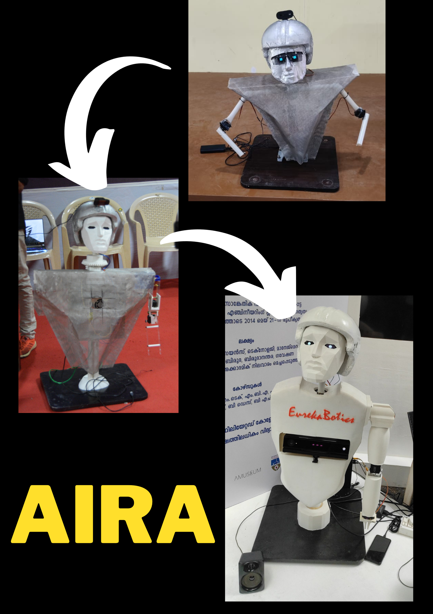

# AIRA
AIRA is a AI-powered humanoid robot designed to revolutionize human-robot interaction. With advanced natural language processing, it effortlessly understands and responds to your commands. Its self-automation capabilities make it invaluable in various applications. 

AIRA is not just a robot; it's a new way to experience automation, companionship, and assistance, offering limitless possibilities for enhancing your daily life and diverse industries.

## Features
AI-powered Conversations
AIRA elevates human-robot interaction to a new dimension with cutting-edge Text-to-Speech and Speech-to-Text technologies, driven by the ever-evolving AI capabilities.

AIRA, equipped with advanced sensors and AI, can perceive its environment, comprehend human speech, and respond with unprecedented intelligence.


## Dependency installation
```
pip3 install -r requirements.txt
```
## API key setup
Go to example_config.ini and add you openai API key there.


# AIRA's Evolution

