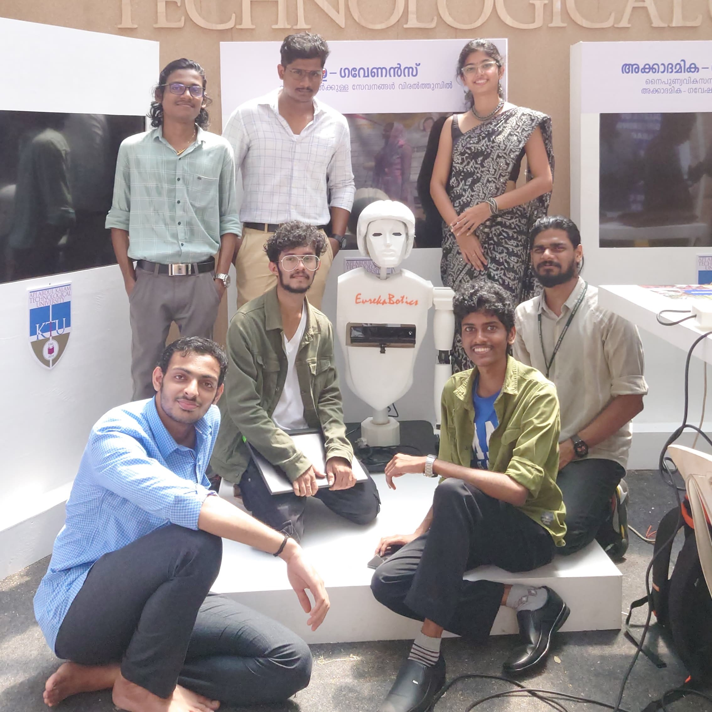

# AIRA
AIRA is a groundbreaking AI-powered humanoid robot designed to revolutionize human-robot interaction. With advanced natural language processing, it effortlessly understands and responds to your commands. Its self-automation capabilities make it invaluable in various applications. AIRA is not just a robot; it's a new way to experience automation, companionship, and assistance, offering limitless possibilities for enhancing your daily life and diverse industries.

<!-- <p align="center">
 
</p> -->

### Features
AI-powered Conversations
AIRA elevates human-robot interaction to a new dimension with cutting-edge Text-to-Speech and Speech-to-Text technologies, driven by the ever-evolving AI capabilities.

### Self Automation
AIRA, equipped with advanced sensors and AI, can perceive its environment, comprehend human speech, and respond with unprecedented intelligence.

### Face Recognition
AIRA incorporates face recognition, creating a more personalized and human-like connection with users.


# Roadmap
 - VQA - blip
 - Baby Protocol
 - Natural Conversation - bark
 - Real-time data access
   - Location Access
   - Time and date
 - Add GUI
 - Website and Team card
 - Head control with commands


# Install Requirements

```
pip3 install -r requirements.txt
```